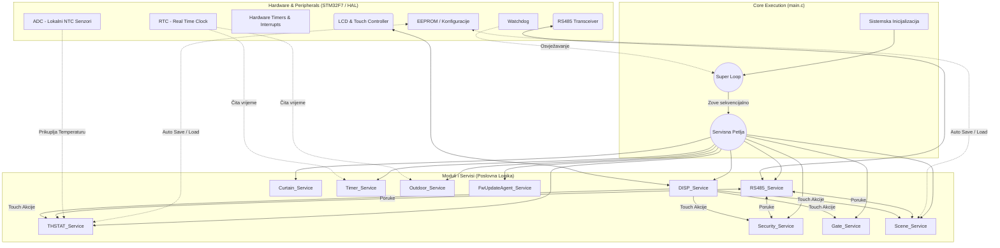

# Arhitektura "Pametne Vile" – Generalni Sistemski Prikaz

Ovaj dokument vizualno i logički prezentuje cjelokupan raspored mikrokontrolerskog sistema (STM32F7xx) koji se vrti oko mehanizma "Super-Loop" (Beskonačna petlja) unutar `main.c`. Dizajn omogućava brzu realizaciju procesa bez potrebe za kompleksnim Real-Time Operativnim Sistemom (RTOS), koristeći isključivo asinkrone statične mašine.

## 1. Sistemski Dijagram (Core System Architecture)

Raspored resursa svake komponente te tok informacija:

## 2. Opis Pojedinačnih Slojeva
- **Hardware & Peripherals**: Sav rad sa senzorima i hardware interfejsom prolazi kroz osnovne drivere. Svi izlazi (`bus`) prema instalaciji idu preko UART-a na RS485.
- **EEPROM**: Najvažniji modul trajne pohrane svake komponente sistema na tačno određenim adresama i offset-ima. Memorisanje scena i postavki (Vrijeme, PIN-ovi, imena).
- **Servisna Petlja (Super Loop)**: Brzina izvršavanja mora biti izuzetno visoka, zbog čega funkcije unutar svake "Service" petlje po pravilu ne smiju koristiti "delay" komande (bez funkcija tipa `HAL_Delay()`), već se oslanjaju na non-blocking `HAL_GetTick()` provjeru za stanje svih softverskih tajmera.

## 3. Analiza Modula ("Divide and Conquer")
Kako ogromna datoteka od +18,000 linija (`display.c`) ne bi opteretila budući kod, moraćemo provesti plan refaktorisanja izdvajanja ekrana u zasebne C fajlove (npr. `display_thermostat.c`, `display_security.c`). U međuvremenu, sve ispod se preuzima za Modul_po_Modul diagrame koji pokreću ovaj Loop u posebnim analizama.
