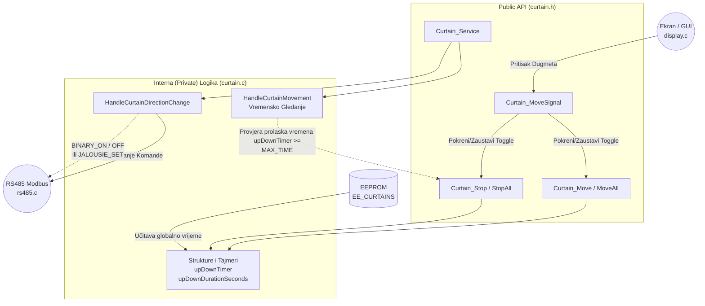

# Interna Arhitektura: Modul Roletne (`curtain.c` / `curtain.h`)

Ovaj dokument reflektuje unutrašnju arhitekturu trenutnog modula roletni koji obrađuje "glupe" (standardne) motore putem vremenskog praćenja kretanja. Posjeduje enkapsulaciju preko Opaque pokazivača (`Curtain_Handle`).

## 1. Dijagram Logičkog Toka (Tajmer Mašina Stanja)

## 2. Analiza Hardversko-Kodne Asimilacije

- **Vremensko Upravljanje ("Tajmer logika"):** Logika kretanja se u potpunosti oslanja na globalnu varijablu vremena putovanja (`curtains_eeprom_data.upDownDurationSeconds`). Kada GUI zada komandu `CURTAIN_UP`, `upDownTimer` zapisuje trenutni `HAL_GetTick()`. Glavna servisna petlja non-stop nadgleda tajmer i samostalno zaustavlja kretanje izdavanjem `CURTAIN_STOP` statusa po isteku predviđenih sekundi, šaljući prekidni signal prema motoru roletne.
- **Relay Adresiranje:** Preko posebne provjere (`handle->config.relayUp.tf != handle->config.relayDown.tf`), sistem prepoznaje da li roletna koristi dva odvojena releja za kontrolu ili pametniju Jalousie kontrolu (ova sekcija će biti izvučena u odvojen pametni modul roletni sa procentima - `JALOUSIE`).

## 3. Buduća Vizija (Smart JALOUSIE vs Dumb CURTAIN)
Kako bismo Scenama obezbjedili pamćene stanja, integrisaćemo mjerenje individualnog vremena od "nulte pozicije" za trenutni sistem glupih motora.  
Uporedo se priprema rad na naprednom, nezavisnom modulu za Jalousie roletne koji će na sebe preuzeti sve `set->new_position` komande te prepoznavati procentualno obaranje, u potpunosti zaobilazeći primitivno tajmer očitavanje MCU-a.
