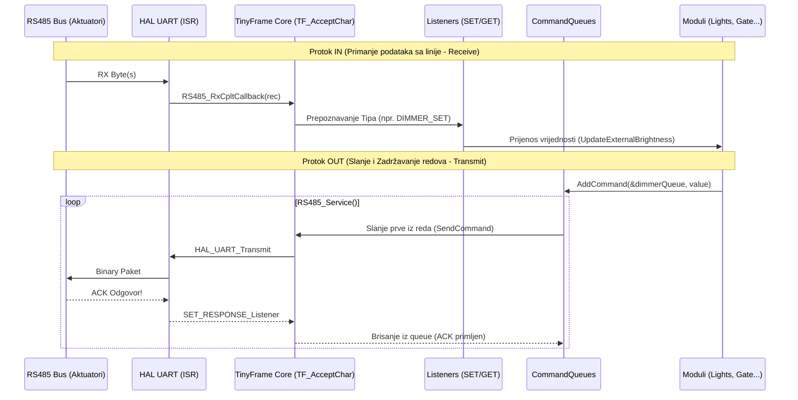

# Interna Arhitektura: Modul RS485 (`rs485.c` / `rs485.h`)

Sistem za eksterni serijski ulaz i interkom komunikaciju izgrađen oko TinyFrame biblioteke za transport layer organizaciju.

## 1. Dijagram Logičkog Toka (RS485 Transport Pipeline)

## 2. Hardversko-Kodne Asimilacije "Oko" Ekstenzije

Ovaj protokol ne sadrži statički mapiran Modbus register table (kao standardni holding/coils proces). On definiše potpuno dinamične okvire poena razgovora (Packets).
- **Redovi (Queues):** Posjeduje `binaryQueue`, `dimmerQueue`, `rgbwQueue`, `curtainQueue` i `thermoQueue`. Ovo omogućava da 5 modbus procesa u isto vrijeme na 5 threadova traže upise, a RS485 će ih glatko strpati u red do okvira 32 dužine.
- **Odloženi Timeout Ciklusi (`HAL_Delay` GAP):** Kad okine zahtjev, petlja trenutno stopira task manager `while(timeout--)`. Ovo se mora razložiti zbog trzanja grafičkog ekrana i prelaska na async čekanje preko callback flagova.
- **Strateški Osvrt na FSD (Zatečeno vs Planirano):** U `RS485_Service()` izbačeni su usporivači i implementiraće se novi RNG ili UniqueID Backoff Buffer, sprječavajući da sinhronizovani zidni kontroleri usred scene zaguše istu modbus frekvenciju nakon boot reseta.
