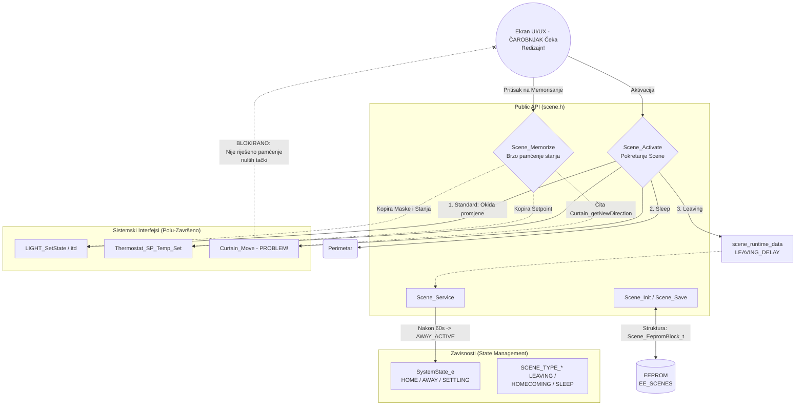

# Interna Arhitektura: Modul Scena (`scene.c` / `scene.h`)

Sistem Scena služi kao glavno "Ljepilo" za sistemski komfor i automatizaciju u ovom projektu.

## 1. Dijagram Modula (Backend Arhitektura i Blokatori)

## 2. Analiza Hardversko-Kodne Asimilacije

- **EEPROM Block i Strukture:** Struktura `Scene_t` dominira mapiranjem (dijeli maske za svjetla, roletne, termostate i sigurnosnu konfiguraciju unutar jednog entiteta). Niz od 6 scena se čuva atomarno unutar bloka `Scene_EepromBlock_t` koji štiti CRC broj.
- **Odložena (Asinhorna) Logika:** Kroz `Scene_Activate()`, scene koje nisu standardne (poput `SCENE_TYPE_LEAVING`) delegiraju zadatak i pale `SCENE_RUNTIME_STATE_LEAVING_DELAY` tajmer u paralelu sa main petljom. `Scene_Service` detektuje istek i prebacuje cijelu zgradu na "Away" mod. Prava event driven softverska izvedba!

## 3. ZATEČENI BLOKATOR (Status: Neispravno do kraja)
Modul implementira izvanredan "Comfort" sistem (svjetla i prenos setpoint komandi), ali nailazi na veliki GAP u razvoju:
1. **Zavisnost na glupim Roletnama:** Trenutna metoda pamćenja snima samo `UP/DOWN/STOP` stanja kroz `Curtain_getNewDirection`. Scena "Čarobnjaka" mora moći u budućnosti mjeriti relativno vrijeme pozicije (Nulta Tačka do stajanja) kako bi znala naćrtati to stanje kroz `curtain_timers` niz - i ovo prvo treba završiti na kodu Modula Roletni da bi Scene radile.
2. **UI/UX Čarobnjak nije napisan:** Dio koda vezan za `display.c` koji navodi korisnika "Odaberi koje želiš svjetlo", "Odaberi koju želiš roletnu", a ne samo brzo `Scene_Memorize` dugme. 
