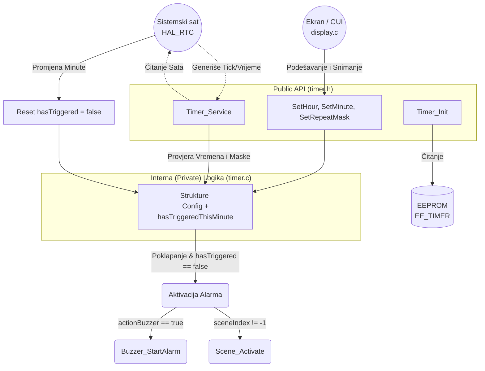

# Interna Arhitektura: Modul Pametni Alarm (`timer.c` / `timer.h`)

Pametni Alarm služi kao globalni sistemski "Cron-job" interfejs. Zastupljen je kao klasični Singleton bez višestrukih instanci. Njegova logička povezanost sa integrisanim funkcijama je visoka (zujalica, poziv scena).

## 1. Dijagram Logičkog Toka (RTC Latching)

## 2. Analiza Hardversko-Kodne Asimilacije

- **Singleton bez Opaque Pointera:** Zanimljivo je da arhitektonski `timer.c` ne koristi `handle` dodjele (`Opaque pokazivač`) kao što su radili `curtains` i `gate`, jer ne nadgleda polje raznih senzora. Konstruisan je kao opšti hardkodovani sistem na jednoj varijabli `static Timer_Runtime_t timer;`. Njegov zadatak je jednostavan i ne nalaže "Device Deskriptore".
- **RTC Latch Sistem (`hasTriggeredThisMinute`):** Pošto `Timer_Service` upada u `main() while(1)` petlju vjerovatno desetine hiljada puta unutar jedne minute, isrogramiran je hardverski i softverski sigurni `latch` mehanizam – bilježi se izvršenje i zaleđava sve okidače unutar tekuće minute, sprječavajući da MCU "zabije" uzastopnim paljenjem zujalice/scene. Reset se dešava precizno prelaskom u narednu minutu.

## 3. Zaključak
Ovo je izuzetno čisto i elegantno postavljen kod. Pruža jednostavnost u razvoju bez ikakvih tehnoloških opstrukcija. U cjelosti se poklapa sa dokumentacijom koja je arhivirana.
