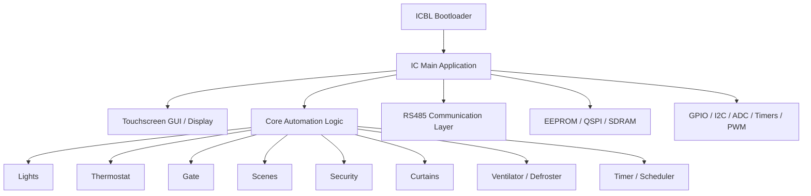
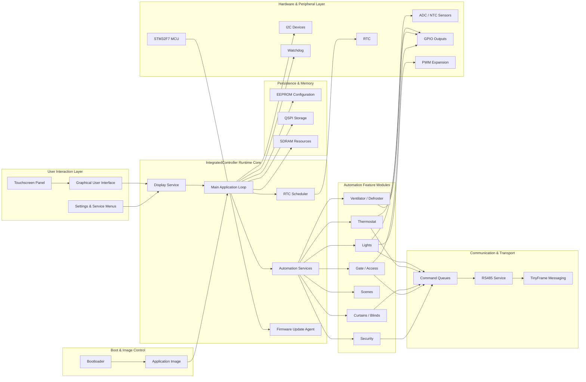
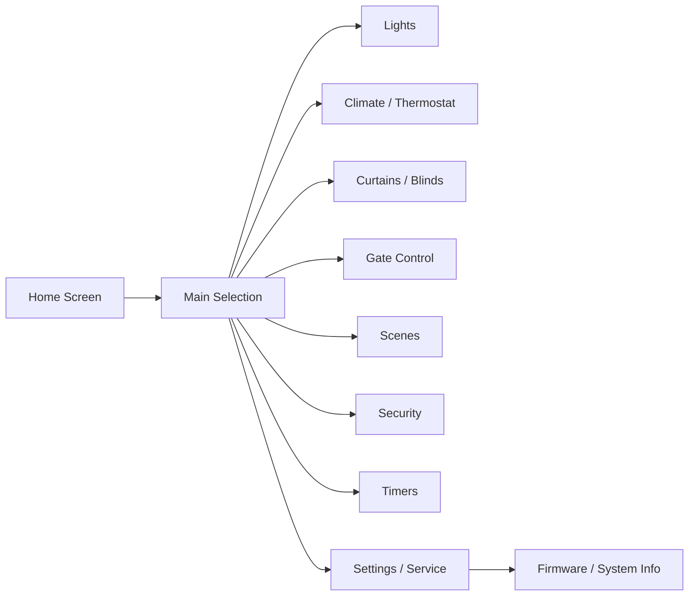

# IntegratedController

<p align="center">
  Embedded smart home control platform built around STM32F7, modular firmware design, touchscreen UI, RS485 communication, persistent configuration storage, and a dedicated bootloader/update pipeline.
</p>

<p align="center">
  <a href="#executive-summary">Executive Summary</a> &middot;
  <a href="#core-capabilities">Core Capabilities</a> &middot;
  <a href="#architecture">Architecture</a> &middot;
  <a href="#screen--ui-flow">UI Flow</a> &middot;
  <a href="#technology-stack">Technology Stack</a> &middot;
  <a href="#project-structure">Project Structure</a> &middot;
  <a href="#documentation">Documentation</a> &middot;
  <a href="#quick-start">Quick Start</a> &middot;
  <a href="#development-status">Development Status</a>
</p>

---

## Executive Summary

**IntegratedController** is a modular embedded control platform designed for advanced smart home and building automation scenarios.

The repository is centered around an **STM32F7-based control unit** with a **touchscreen-driven local interface**, **RS485 field communication**, **persistent EEPROM-based configuration**, **modular device control**, and a **dedicated bootloader/application split** for controlled firmware lifecycle management.

It is structured as a **complete embedded system platform** with clear separation between:

- **boot-time firmware control**
- **runtime application logic**
- **device/domain modules**
- **GUI and interaction logic**
- **communication transport and queues**
- **persistent storage and configuration handling**
- **hardware abstraction and middleware**

The result is a codebase that is valuable both as a **production-grade smart home controller** and as a **well-organized embedded software architecture reference**.

### Highlights

- **STM32F746-class embedded platform**
- **Dedicated bootloader (`ICBL`) and main firmware (`IC`)**
- **Touchscreen-based local user interface**
- **RS485 communication stack with TinyFrame-based transport**
- **Firmware update support and handoff pipeline**
- **EEPROM-backed persistent configuration**
- **Modular subsystem design for automation features**
- **Architecture and functional design documentation in `Docs/`**
- **Clear source/include split and Keil project structure**

---

## Why This Project Stands Out

IntegratedController combines several qualities that rarely appear together in one embedded automation repository:

- **Product-oriented structure** instead of a single monolithic prototype
- **Dedicated bootloader + application separation**
- **UI, communication, storage, and actuator logic integrated in one platform**
- **Feature ownership through domain-specific modules**
- **Design documentation that matches the implementation direction**
- **Architectural discipline across firmware, UI, and communication layers**

This makes the project highly suitable for professional presentation as a **serious embedded smart home control platform**.

---

## Core Capabilities

IntegratedController brings together multiple automation domains inside one controller platform.

### Smart Lighting
- local GPIO-driven outputs
- extended bus-controlled lighting devices
- dimming and output state handling
- grouped behavior and scene interaction
- icon-driven local control interface

### Climate and Thermal Control
- thermostat control logic
- NTC sensor acquisition and filtering
- fan/ventilation coordination
- defroster integration
- master/slave synchronization model over the bus

### Curtains / Blinds
- timed movement logic for standard motors
- UI-triggered motion commands
- service-loop tracking of motion duration
- structured blind and curtain control domain

### Gate and Access Control
- dedicated gate module
- action-driven control flow
- profile-based gate behavior abstraction
- support for multiple access-control behaviors

### Scenes and Automation
- memorized scene states
- grouped activation of multiple subsystems
- delayed and timed scene activation
- integration with lighting, thermostat, curtains, and security domains

### Security / Alarm
- partition-aware security model
- user PIN validation
- persistent security settings
- asynchronous execution through communication queues
- local UI control plus bus event synchronization

### Scheduling and Timed Actions
- RTC-based timer logic
- scheduled actions and timed triggers
- latching logic to prevent repeated execution within the same minute
- integration with scenes and buzzer-driven actions

### Local HMI / Touch UI
- large display module based on screen-state routing
- multi-screen interaction model
- touch handling and redraw logic
- integrated icon/resource presentation layer

### Firmware Lifecycle
- bootloader-controlled startup
- firmware validation and image handoff
- update handling through a dedicated update path
- structured backup and recovery flow

---

## System Overview



---

## Premium System Diagram



---

## Architecture

The repository is organized around two major firmware targets and a set of supporting layers that together form the controller platform.

### 1. Bootloader Layer

The **`ICBL`** project contains the bootloader logic responsible for:

- startup validation
- firmware presence checks
- firmware copy/replace flow
- backup/recovery handling
- controlled transfer of execution to the application image

This makes the firmware lifecycle more resilient and production-oriented than a single-image embedded design.

### 2. Main Application Layer

The **`IC`** project contains the primary runtime firmware.
It performs hardware initialization and then coordinates the controller logic through a **service-loop execution model**.

Core runtime responsibilities include:

- peripheral initialization
- display and touch servicing
- sensor acquisition
- subsystem orchestration
- timer/scheduling logic
- communication processing
- watchdog refresh
- firmware update agent servicing

### 3. Super-Loop Execution Model

The application is built around a **high-frequency super loop** in `main.c`, where services are executed in sequence rather than being distributed across a large RTOS task graph.

That structure keeps the system predictable and makes it easier to understand end-to-end control flow:

- initialize hardware and memory-backed settings
- initialize modules
- enter the main loop
- run service functions for GUI, sensors, device modules, timers, communication, and update handling

This is a strong fit for embedded control systems that require deterministic service order and tight integration between modules.

### 4. Module-Based Domain Design

The application is divided into dedicated modules, each owning a specific automation concern:

- **Lights**
- **Thermostat**
- **Gate**
- **Scene**
- **Security**
- **Curtain**
- **Timer**
- **Ventilator**
- **Defroster**
- **Display**
- **Firmware Update Agent**
- **RS485**
- **Buzzer**

This modular breakdown is one of the strongest aspects of the project because it improves maintainability, extension, and documentation alignment.

### 5. Persistent Configuration Model

A recurring architectural theme across the repository is **persistent configuration backed by EEPROM**.

Subsystems load and save structured configuration/state data such as:

- addresses
- feature enablement
- timings and delays
- names and labels
- PINs and system settings
- scene and schedule data

This makes the controller behave like a configurable automation product rather than a stateless firmware image.

### 6. Communication Architecture

The communication stack revolves around **RS485** and framed message transport through **TinyFrame**.

The design includes:

- UART callback integration
- framed receive parsing
- listener-driven message handling
- command queues for outgoing actions
- asynchronous interaction with modules such as lights, gates, thermostat, and security

This allows the controller to coordinate both local and remote devices over a field bus.

### 7. UI / Display Architecture

The display layer is one of the major architectural blocks of the project.

Based on the design documents and repository layout, the UI follows a **screen-state machine pattern**, where screens are initialized, serviced, and torn down in a controlled lifecycle.

Key traits include:

- touchscreen event handling
- screen-based routing
- widget-driven rendering
- icon-backed UI assets
- support for multiple operational screens

### 8. Hardware Integration Layer

The codebase integrates with multiple MCU and board-level resources, including:

- **RTC**
- **CRC**
- **ADC**
- **I2C**
- **UART / RS485**
- **GPIO**
- **QSPI**
- **SDRAM**
- **touchscreen/display support**
- **watchdog**
- **timers and PWM expansion**

This breadth is another sign that the project is intended as a complete control platform.

---

## Architectural Characteristics

A few implementation patterns make the repository stand out even more.

### Encapsulation and Module Ownership
Several modules are documented and implemented around stronger encapsulation boundaries, including handle/object-like patterns and module-private runtime logic.

### EEPROM-Centric Reliability
Configuration and runtime persistence are treated as first-class concerns. This is especially important in smart home installations where controller state must survive resets and firmware transitions.

### Queue-Driven Communication
Instead of tightly coupling every module directly to UART transmission, the architecture uses queues and staged communication handling. This reduces direct contention and keeps module logic cleanly separated.

### UI as a First-Class Subsystem
The project does not treat the display as a thin debug shell. It is a major operating surface of the controller, with icons, screen flows, and dedicated service logic.

### Structured Engineering Discipline
The documentation and module organization show clear engineering discipline across firmware, UI, storage, and communication layers.

---

## Module Deep Dive

### Lights Module
The lighting subsystem is one of the most mature parts of the platform.
It combines multiple operational domains inside one feature layer:

- local GPIO outputs
- networked/bus-driven devices
- dimmer/PWM-like behavior
- timer-based behavior and grouped control
- persistent configuration per light element

This gives the project a flexible foundation for both simple switched outputs and more advanced lighting behaviors.

### Thermostat Module
The thermostat subsystem is built around a more encapsulated runtime model and supports a **master/slave concept** for synchronized climate control behavior.

Highlights include:
- measured temperature input from ADC/NTC flow
- filtered sensor processing
- fan and climate coordination
- bus-synchronized information sharing
- persistent behavior and configuration

### Gate Module
The gate subsystem is one of the most architecturally elegant areas of the repository.
It is described around a **profile-driven / universal state-machine-like approach**, which allows different access-control behaviors to be represented without duplicating the whole logic path.

### Curtain Module
The curtain/blind subsystem uses timed-movement logic and service-loop tracking to manage standard motors.
It supports practical motion behavior inside the integrated automation workflow.

### Scene Module
Scenes act as a **system-level glue layer** between subsystems.
They enable grouped comfort and automation behaviors by coordinating lighting, thermostat, curtain, and security-related actions.

### Security Module
The security subsystem acts as a controller between UI-driven user actions and asynchronous field execution.
It stores system configuration, validates user codes, and updates armed/alarm state through communication events.

### Timer Module
The timer subsystem functions as a scheduling layer based on the RTC.
It can trigger buzzer or scene-oriented actions and uses trigger-latching behavior to avoid duplicate execution in the same time window.

### Display Module
The display subsystem is a major feature in itself.
It contains the local HMI logic, screen state routing, widget handling, and touch-driven interaction patterns that make this controller usable as a standalone interface panel.

### RS485 Module
The RS485 subsystem serves as the transport backbone for external coordination.
It is tightly connected to TinyFrame, UART callbacks, listeners, and command queues, making it one of the main integration points of the whole platform.

---

## Main Functional Areas

### Lighting Control
The controller provides a dedicated lighting subsystem suitable for room-level and zone-level control, including state changes, brightness-style behavior, persistence, and scene participation.

### Climate / Thermostat Control
Thermostat and related climate features are a core part of the system, combining sensor measurement, local logic, fan behavior, and network-assisted synchronization.

### Access and Gate Control
Gate-related control is implemented as a dedicated subsystem, indicating support for managed access devices with differentiated behavior profiles.

### Scenes and Automation
Scene handling allows the controller to move beyond direct manual control and into coordinated automation behavior across several subsystems.

### Security Logic
The inclusion of a full security/alarm-oriented module demonstrates that the platform is intended for broader building-control use cases, not only comfort automation.

### Touchscreen User Interface
The display and touch stack makes the controller suitable as a local operator panel, not just as a hidden embedded node.

### Firmware Lifecycle Management
The combined bootloader and update path provide a strong foundation for maintainable firmware deployment and evolution.

---

## Screen / UI Flow

The repository clearly points toward a touchscreen-centric local experience. The UI is structured as a screen router with functional branches into the key automation domains.



### Visual Assets Already Present
The repository already contains icon assets for several functional areas, including examples related to:

- lights
- thermostat
- blinds
- gates
- ventilator
- defroster

This further reinforces the product-grade presentation quality of the platform.

---

## Technology Stack

### Languages
- **C** — main firmware implementation
- **HTML / JavaScript / CSS** — supporting UI/web-related assets present in the repository
- **Assembly / C++** — low-level and supporting components

### Microcontroller / Platform
- **STM32F7 series**
- **STM32 HAL**
- **CMSIS**
- board support for display/touch and external memory

### Communication and Integration
- **RS485**
- **TinyFrame** message framing
- UART callback-driven transport handling
- command-queue-based module interaction

### Memory / Persistence
- **EEPROM**
- **QSPI**
- **SDRAM**
- persistent config structures and saved runtime settings

### UI / HMI
- touchscreen-driven local UI
- icon/resource-backed display layer
- screen lifecycle/state routing model

### Tooling / Project Layout
- **Keil MDK-ARM** project structure
- separate targets for application and bootloader
- architecture and FSD documentation included in-repo

---

## Project Structure

```text
.
├── Archive/             # Historical or archived material
├── Common/              # Shared headers, utilities, build/version helpers
├── Docs/                # Architecture and functional documentation
│   ├── Architecture/
│   │   └── Modules/
│   └── FSD/
├── Drivers/             # MCU, CMSIS, HAL and hardware support layers
├── IC/                  # Main application firmware
│   ├── Inc/
│   ├── Src/
│   └── MDK-ARM/
├── ICBL/                # Bootloader firmware
│   ├── Inc/
│   ├── Src/
│   └── MDK-ARM/
├── Icons/               # Visual/UI assets and embedded icon resources
├── LUX protokoli/       # Protocol-related material
├── Middlewares/         # Middleware libraries and integrations
└── README.md
```

### Main Firmware (`IC/`)
The main application contains the runtime logic of the controller, including hardware initialization, UI servicing, communication, sensor handling, and subsystem coordination.

### Bootloader (`ICBL/`)
The bootloader provides startup control and firmware handoff/update support.

### Shared Infrastructure (`Common/`)
This layer contains common headers, shared definitions, and helper files related to build/version support and cross-project coordination.

### Documentation (`Docs/`)
The repository includes both architecture documentation and functional specification-style documents for important subsystems.

### Icons (`Icons/`)
The icon directory confirms the existence of a richer display-oriented system and reinforces the visual identity of the controller platform.

### Notable Source Modules
Within `IC/Src/`, the project includes modules such as:

- `main.c`
- `display.c`
- `lights.c`
- `thermostat.c`
- `gate.c`
- `scene.c`
- `security.c`
- `curtain.c`
- `timer.c`
- `ventilator.c`
- `defroster.c`
- `rs485.c`
- `firmware_update_agent.c`
- `buzzer.c`

This is a strong indicator of deliberate feature ownership and subsystem-oriented development.

---

## Documentation

One of the strongest assets of this repository is that it already contains internal documentation alongside implementation.

### Architecture Documentation
Under `Docs/Architecture/`, the project contains:

- general system architecture material
- module-level architecture notes
- design guidance

### Functional Design Specifications
Under `Docs/FSD/`, the repository includes functional documents for areas such as:

- alarm/security
- display
- gate
- lights
- outdoor lights
- RS485
- curtains
- scenes/UI
- thermostat
- timer
- MQTT/WiFi bridge integration
- alphanumeric keypad support

This is important because it shows that the project is developed with **system thinking** and strong technical traceability.

### Why the Documentation Matters
This documentation layer gives the project additional value in three ways:

1. it improves onboarding
2. it preserves design intent across iterations
3. it elevates the repository from implementation-only to engineering-documentation-backed work

---

## Use Cases

IntegratedController is suitable for presentation as a platform supporting use cases such as:

- smart room control panels
- villa and residential automation
- local wall-mounted touchscreen controllers
- integrated lighting and climate control
- scenes such as home, away, sleep, and comfort routines
- access/gate and security coordination
- centralized embedded automation nodes with field communication

---

## Quick Start

### Requirements

Typical requirements for working with this project include:

- STM32F7-compatible target hardware
- Keil MDK-ARM environment
- STM32 HAL/CMSIS support
- display and touchscreen-capable target hardware
- required external memory configuration where applicable
- RS485-capable physical communication path
- connected peripherals/modules depending on the feature set being used

### Basic Workflow

1. Clone the repository
2. Open the relevant project:
   - `IC/MDK-ARM/` for the main application
   - `ICBL/MDK-ARM/` for the bootloader
3. Configure the target and toolchain environment
4. Build the bootloader and application images
5. Flash the firmware to the target hardware
6. Verify initialization, display behavior, communication flow, and subsystem operation

---

## Development Status

The repository reflects a **substantial embedded system implementation** with:

- separate bootloader and application targets
- multiple mature domain modules
- hardware integration across several peripheral classes
- persistent configuration logic
- a substantial local display/UI subsystem
- communication infrastructure for external device coordination
- architecture and functional documentation

### Current Strengths
The strongest qualities visible in the repository are:

- strong modularity in the application layer
- broad automation scope
- practical firmware architecture
- clear effort toward encapsulation and cleanup
- a serious embedded-HMI orientation

### Platform Direction
The repository also demonstrates a clear architectural direction across:

- user experience and screen organization
- modular device control
- firmware lifecycle handling
- automation orchestration
- communication protocol layering

---

## Repository Focus

IntegratedController is best understood as a combination of:

- **embedded firmware platform**
- **smart home control application**
- **touchscreen HMI system**
- **field communication node**
- **persistent-config automation controller**
- **firmware-update capable device platform**

That combination is what makes the project especially compelling as a serious embedded systems repository.

---

## Presentation Value

IntegratedController can be presented as a **modern embedded product platform** with strong technical depth, visual interaction capability, and a complete automation-oriented architecture.

Its strongest presentation qualities are:

- a clear embedded product structure
- integrated touchscreen HMI
- field communication and control logic
- persistent configuration model
- modular subsystem architecture
- dedicated bootloader and firmware update path

---
