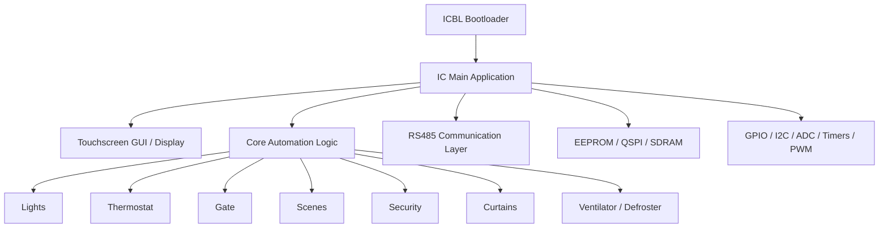
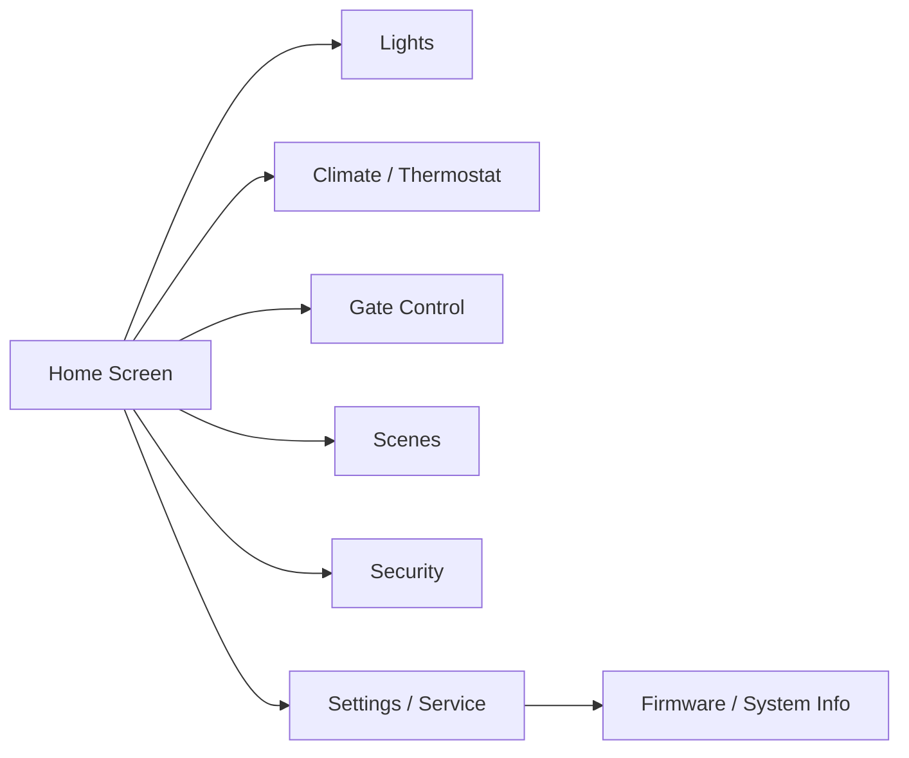

# IntegratedController

<p align="center">
  Embedded smart home control platform built around STM32F7, modular firmware design, touchscreen UI, RS485 communication, and a dedicated bootloader/update pipeline.
</p>

<p align="center">
  <a href="#executive-summary">Executive Summary</a> &middot;
  <a href="#architecture">Architecture</a> &middot;
  <a href="#quick-start">Quick Start</a> &middot;
  <a href="#technology-stack">Technology Stack</a> &middot;
  <a href="#project-structure">Project Structure</a> &middot;
  <a href="#development-status">Development Status</a>
</p>

---

## Executive Summary

**IntegratedController** is a modular embedded control platform for advanced smart home and building automation scenarios.

The project is centered around an **STM32F7-based control unit** with a **touchscreen-driven interface**, **real-time device orchestration**, **RS485 field communication**, and a **dedicated bootloader/application split** for firmware lifecycle management.

Rather than being a simple demo firmware, this repository is structured as a **full embedded system platform** with clearly separated responsibilities:

- a **main application** for runtime logic and user interaction
- a **bootloader** for controlled startup and firmware replacement
- a set of **domain modules** for automation subsystems
- a **communication layer** for networked devices
- a **GUI/display stack** for local control
- reusable **common infrastructure**, drivers, and middleware

This makes the project suitable not only as a functional smart home controller, but also as a strong example of **organized embedded software architecture**.

### Highlights

- **STM32F746-class embedded platform**
- **Dedicated bootloader (`ICBL`) and main firmware (`IC`)**
- **Touchscreen-based local user interface**
- **RS485 communication stack**
- **Firmware update support**
- **Modular subsystem implementation**
- **Structured codebase with reusable common layer**
- **Architecture and functional documentation in `Docs/`**

---

## Why This Project Stands Out

This repository is especially valuable because it combines several qualities that are rarely present together in one embedded automation project:

- **Real product structure** instead of a single-file prototype
- **Clear module boundaries** for domain logic
- **Integration of UI, field bus communication, and firmware lifecycle**
- **Scalable foundation** for extending automation features
- **Well-organized embedded C codebase** with supporting documentation

In short, this is not just a microcontroller project — it is a **complete embedded control platform**.

---

## System Overview



---

## Architecture

The repository is organized around two major firmware targets and several supporting layers.

### 1. Bootloader Layer

The **`ICBL`** project contains the bootloader logic responsible for:

- startup validation
- firmware selection
- firmware copy/replace flow
- backup/recovery handling
- controlled transfer of execution to the main application

This gives the system a more production-oriented firmware lifecycle compared to typical monolithic embedded projects.

### 2. Main Application Layer

The **`IC`** project contains the primary application firmware.  
It initializes the hardware platform and coordinates the runtime services in the main loop.

Core responsibilities include:

- peripheral initialization
- GUI/display servicing
- sensor readout and state processing
- subsystem orchestration
- bus communication
- timing and scheduling-related services
- update agent integration

### 3. Domain Modules

The application is divided into dedicated modules for smart home features, including:

- **Lights**
- **Thermostat**
- **Gate**
- **Scene**
- **Security**
- **Curtain**
- **Ventilator**
- **Defroster**
- **Buzzer**
- **Display**
- **Firmware Update Agent**
- **RS485**

This modular breakdown makes the codebase easier to understand, maintain, and extend.

### 4. Communication and Device Integration

The platform uses **RS485** as an external communication channel and includes middleware such as **TinyFrame** for framed message transport.

This enables the controller to function as part of a broader device network rather than a standalone isolated unit.

### 5. Memory and Hardware Integration

The codebase also shows integration with embedded platform resources such as:

- **EEPROM**
- **QSPI**
- **SDRAM**
- **ADC**
- **I2C**
- **UART / RS485**
- **Timers / PWM**
- **GPIO**
- **CRC / watchdog / RTC**

This makes the project architecturally closer to a complete product firmware than to a lab example.

---

## Main Functional Areas

### Lighting Control
The project includes a dedicated lighting module with local and extended output handling, suitable for room and zone-based automation scenarios.

### Climate / Thermostat Control
Thermostat-related logic is one of the core parts of the system, including sensor-driven temperature handling and coordination with ventilation/defrost-related features.

### Access and Gate Control
Gate-related control logic is implemented as a dedicated module, indicating support for motorized or managed entry mechanisms.

### Scenes and Automation
The presence of a dedicated `scene` module suggests support for grouped actions and coordinated control behavior across multiple devices.

### Security Logic
A dedicated security subsystem is included, showing that the platform is designed to go beyond simple environmental control.

### Touchscreen User Interface
The display/UI part is a major element of the project, making the controller suitable as a local wall-mounted or panel-based smart home interface.

### Firmware Lifecycle Management
With both a bootloader and update-related application code, the platform supports a more advanced deployment and maintenance model.

---

## Screen / UI Flow

You mentioned adding a Mermaid screen diagram later — this is a good place for it.  
Here is a clean placeholder version you can keep or expand when screenshots are ready:



> Later, this section can be enriched with:
> - real UI screenshots
> - screen hierarchy diagrams
> - feature-to-screen mapping
> - navigation examples

---

## Technology Stack

### Languages
- **C** — main firmware implementation
- **HTML / JavaScript / CSS** — supporting interface-related assets present in the repository
- **Assembly / C++** — low-level and supporting components

### Platform
- **STM32F7 series**
- **CMSIS / STM32 HAL**
- **Embedded peripherals and board support**
- **Touchscreen display stack**
- **RS485 field communication**
- **FreeRTOS-related middleware/components present in the project structure**

### Middleware / Supporting Components
- **TinyFrame**
- **CMSIS**
- STM32 driver layers
- common reusable project infrastructure

---

## Project Structure

```text
.
├── Archive/             # Historical or archived material
├── Common/              # Shared headers, utilities, build/version helpers
├── Docs/                # Architecture and functional documentation
│   ├── Architecture/
│   └── FSD/
├── Drivers/             # MCU, CMSIS, HAL and hardware support layers
├── IC/                  # Main application firmware
│   ├── Inc/
│   ├── Src/
│   └── MDK-ARM/
├── ICBL/                # Bootloader firmware
│   ├── Inc/
│   ├── Src/
│   └── MDK-ARM/
├── Icons/               # Visual/UI assets
├── LUX protokoli/       # Protocol-related material
├── Middlewares/         # Middleware libraries and integrations
└── README.md
```

### Notable Source Modules

Within `IC/Src/`, the project includes modules such as:

- `main.c`
- `display.c`
- `lights.c`
- `thermostat.c`
- `gate.c`
- `scene.c`
- `security.c`
- `curtain.c`
- `ventilator.c`
- `defroster.c`
- `rs485.c`
- `firmware_update_agent.c`

This is one of the strongest indicators that the codebase is intentionally structured around feature ownership.

---

## Documentation

Additional design material already exists in the repository:

- `Docs/Architecture/`
- `Docs/FSD/`

This is a strong asset and should definitely remain visible in the README, because it shows that the project includes both implementation and design-level thinking.

---

## Quick Start

> This repository is currently best approached as an **embedded firmware codebase and architecture reference**.  
> Exact board bring-up, flashing, and production deployment steps can be documented further as the repository evolves.

### Requirements

Typical requirements for working with this project include:

- STM32F7-compatible target hardware
- Keil MDK-ARM project support (`MDK-ARM/`)
- STM32 drivers and CMSIS environment
- appropriate display/touch hardware
- external peripherals used by the controller platform
- RS485-capable hardware path for communication-related features

### Basic Workflow

1. Clone the repository
2. Open the relevant project:
   - `IC/MDK-ARM/` for the main application
   - `ICBL/MDK-ARM/` for the bootloader
3. Configure the toolchain and target board environment
4. Build bootloader and application firmware
5. Flash to the target device
6. Verify startup, display, communication, and subsystem behavior

### Suggested Future README Additions
If you want to make onboarding even stronger later, I recommend adding:

- exact board name / MCU variant
- toolchain version
- flashing instructions
- memory map summary
- bootloader/application relationship
- screenshots of the UI
- protocol notes for RS485 integration

---

## Development Status

The repository already reflects a **substantial embedded system implementation** with:

- separated bootloader and application targets
- multiple domain modules
- hardware integration
- UI/display logic
- communication infrastructure
- documentation directories

At the same time, there is still room to evolve the presentation layer of the repository by adding:

- polished screenshots
- a more detailed setup guide
- hardware overview diagrams
- protocol examples
- contribution guidelines
- licensing information

In other words, the **engineering depth is already there** — the next step is mainly **presentation and documentation polish**.

---

## Roadmap Ideas

Possible next README/documentation improvements:

- [ ] Add real hardware photos
- [ ] Add UI screenshots
- [ ] Add board/block diagram
- [ ] Add memory map overview
- [ ] Add RS485 protocol overview
- [ ] Add firmware update flow diagram
- [ ] Add build and flashing instructions
- [ ] Add module-by-module documentation links

---

## Repository Focus

This project is best understood as a combination of:

- **embedded firmware platform**
- **smart home control application**
- **touchscreen HMI system**
- **field communication node**
- **firmware-update capable controller**

That combination is what makes **IntegratedController** especially interesting as a serious embedded systems project.

---
